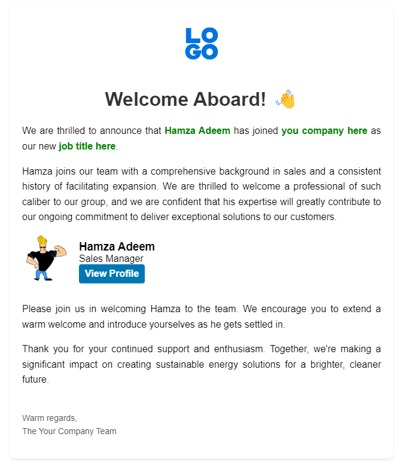

# Email Templates Repository

Welcome to our collection of responsive and professionally designed email templates.

## Overview

This repository is a curated collection of email templates to cater to a variety of business communications. Each template is crafted to ensure compatibility across all major email clients and to be easily customized.

## First Template Release

Our first template is a versatile template suitable for newsletters, announcements, or marketing campaigns.

### Viewing the Template

To see a preview of our first email template, please check out the image below:

## Usage

To use these templates:

1. Clone the repository or download the desired template directly.
2. Open the template file in an HTML editor.
3. Customize the template with your specific content and branding.
4. Send it using your preferred email marketing tool.

## Contribution

If you'd like to contribute to this repository, please fork the repo and submit a pull request with your proposed changes or additions.

We appreciate feedback and contributions to improve the quality and effectiveness of these email templates.

## License

This project is licensed under the MIT License - see the [LICENSE.md](LICENSE.md) file for details.

Thank you for visiting our email templates repository!
